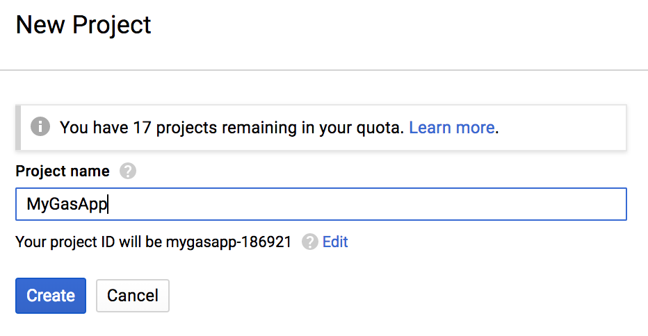
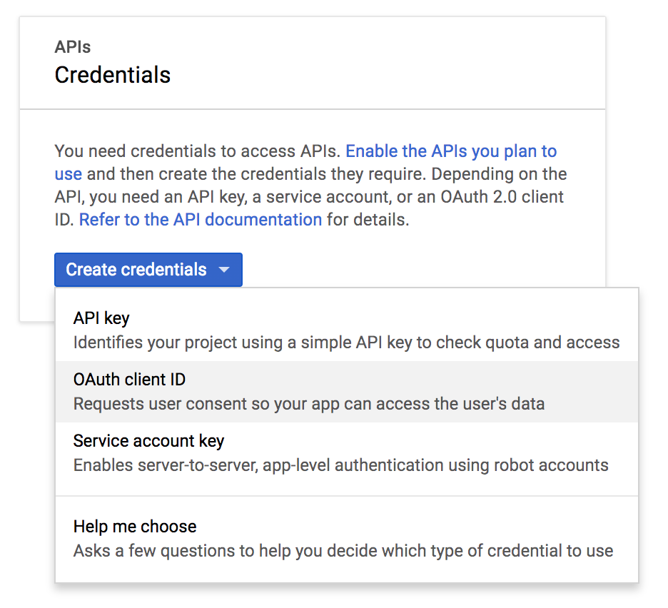
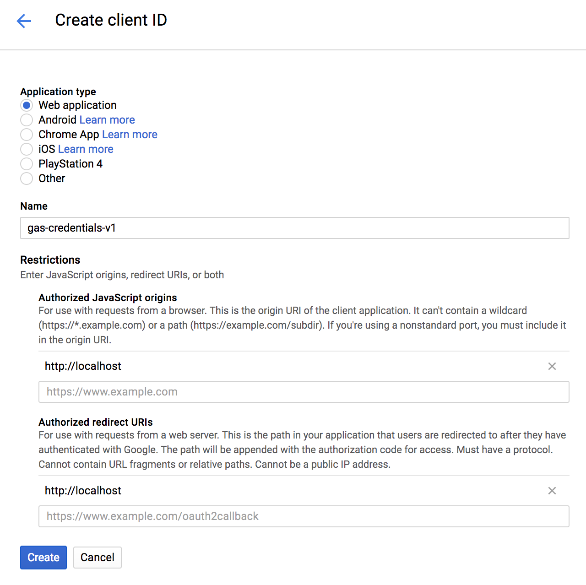

# How to setup a a custom Google OAuth2 client for gas, from A to Z

## [1] Creating a Google Cloud project
- Go to https://console.cloud.google.com/projectcreate to create a project
- Pick a 'Project name' (e.g. 'MyGasApp')
- Click 'Create'

## [2] Setup Oauth consent screen
- Go to the 'Oauth consent screen'-tab
- Fill in a 'Product name shown to users' (e.g 'Gas')   
 
<i> All other fields are optional.   
(https://raw.githubusercontent.com/MaartenDesnouck/google-apps-script/master/images/logo/gas-logo.png, might be a good 'Product logo URL')</i>

- Click 'Save'

## [3] Create API credentials
- Go to the 'Credentials'-tab
- Click 'Create credentials'
- Click 'OAuth client ID'

- Pick 'Web application'
- Fill in a 'Name' for the set of credentials you are creating (e.g. gas-credentials-v1)
- Add 'http://localhost' to the 'Authorized JavaScript origins'
- Add 'http://localhost' to the 'Authorized redirect URIs'
- Click 'Create'   

<i> You will get a pop-up with some keys, don't close this pop-up but go to step [4]</i>

## [4] Configuring gas to use your credentials
- Go to your terminal
- Run 'gas config'
- Answer the question if you want to use .gs as default extension ('n' will keep the default extension)
- Answer 'y' to the question if you want to use a custom OAuth 2.0 client
- Paste the client ID from the pop-up
- Paste the 'client secret' from the pop-up   
<i>You should see 'Succesfully configured gas [✔]'</i>
- Run 'gas auth'
- You should be redirected to approve your new credentials to make API requests to your Google Drive
